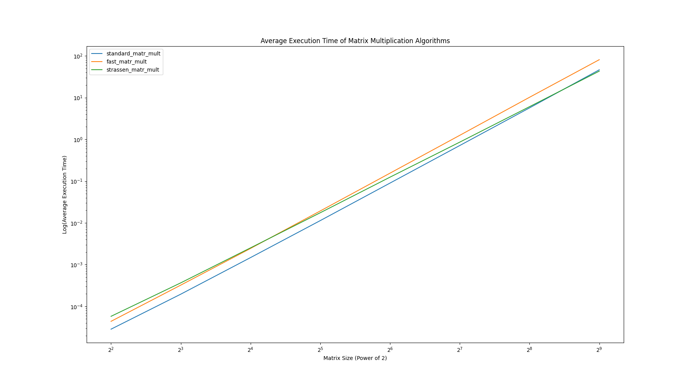
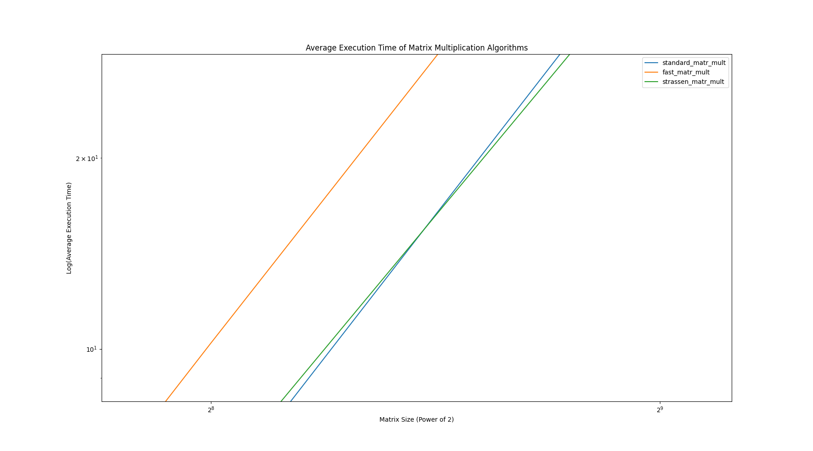
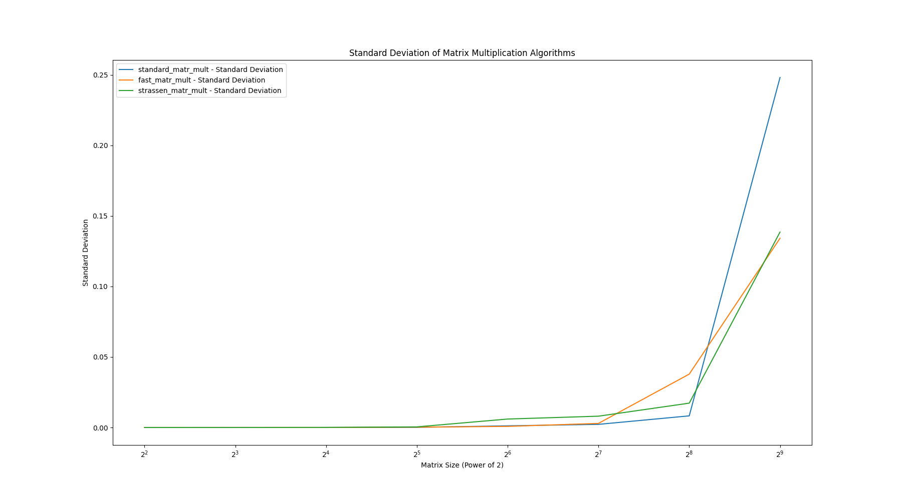
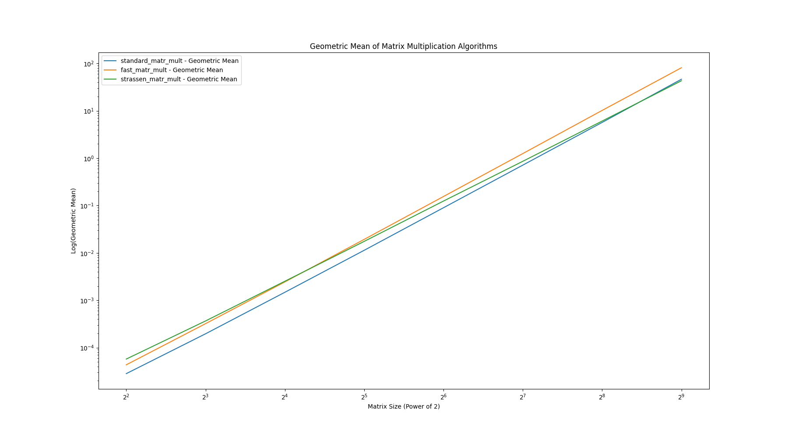

# Тест производительности алгоритмов умножения матриц

В данном документе описан тест производительности алгоритмов умножения матриц. Протестированные алгоритмы включают в
себя:

1. Стандартное умножение матриц (`standard_matr_mult`)
2. Быстрое умножение матриц 8 рекурсивных вызовов (`fast_matr_mult`)
3. Умножение матриц методом Штрассена (`strassen_matr_mult`)

## Подготовка к тесту

- Размеры матриц: Степени 2 в пределах от 16 до 512
- Количество запусков: 10
- Для каждого теста генерируются случайные матрицы

## Стенд

- Ryzen 5 5600X

## Результаты теста

### Среднее время выполнения

- Первый график отражает среднее время выполнения каждого алгоритма в зависимости от размера матриц (степени 2 от 2 до 9).
- Ось x представлена в логарифмической шкале (основание 2), а ось y представляет логарифм среднего времени выполнения.

### Стандартное отклонение

- Второй график иллюстрирует стандартное отклонение времени выполнения каждого алгоритма в зависимости от размера
  матриц.

### Среднее геометрическое

- Третий график отображает среднее геометрическое времени выполнения каждого алгоритма в зависимости от размера матриц.

## Заключение

- Алгоритм Штрассена начинает выигрывать по среднему времени выполнения на довольно больших рамзерах матриц (512).
- `fast_matr_mult` Оказалась самой не эффективной, скорее всего из-за порога fallback'a умножения матриц (3)
